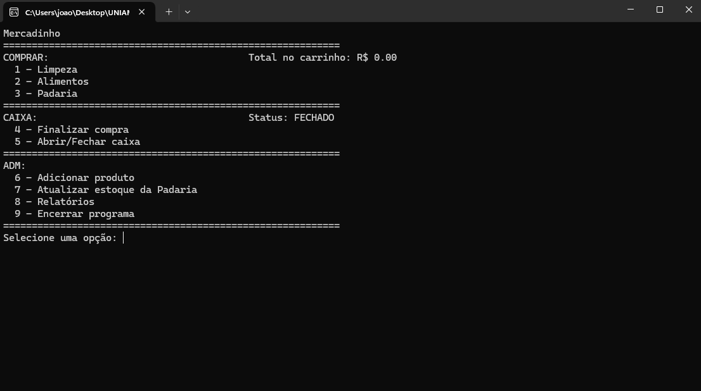

# Sistema de Gestão de Supermercado em C

> Aplicação de linha de comando desenvolvida em C para simular um sistema de ponto de venda e gestão de estoque. **Este projeto obteve a nota máxima (100/100) na avaliação da disciplina.**

## 📖 Sobre o Projeto

Desenvolvido como projeto final para a disciplina de Algoritmos e Estruturas de Dados, o objetivo era aplicar conceitos fundamentais da Engenharia de Software para criar um sistema funcional e robusto, com foco em gerenciamento de memória, manipulação de dados e persistência de informações em arquivos.

O sistema gerencia um catálogo de produtos, controla o estoque, processa vendas em um carrinho de compras dinâmico e gera relatórios detalhados, tudo através de uma interface interativa no terminal.

## 📸 | Menu Principal |
| :---: |
|  |

## ✨ Funcionalidades Principais

* **Gestão de Produtos:** Adição de novos produtos e carregamento do estoque, organizados em uma **Árvore Binária de Busca** para performance otimizada.
* **Carrinho de Compras:** Implementação de um carrinho dinâmico usando uma **Lista Encadeada Simples**.
* **Sistema de Caixa:** Funcionalidades para abrir e fechar o caixa, com o saldo sendo persistido entre as sessões.
* **Relatórios Avançados:** Geração de relatórios de produtos e vendas, com opções de ordenação por nome ou por código, utilizando a função `qsort` da biblioteca padrão.
* **Persistência de Dados:** Os dados do programa, como produtos, vendas e logs de eventos, são salvos e carregados a partir de **arquivos de texto (.txt) criados e atualizados em tempo real** durante a execução.

## 🛠️ Tecnologias e Conceitos Aplicados

* **Linguagem:** C (Puro)
* **Estruturas de Dados:** Árvore Binária de Busca, Lista Encadeada Simples.
* **Algoritmos:** `qsort` (Quicksort) para ordenação de relatórios.
* **Gerenciamento de Memória:** Alocação dinâmica com `malloc` e `free`.
* **Manipulação de Arquivos:** Leitura e escrita em arquivos (`fopen`, `fprintf`, `fscanf`).

## 🚀 Como Executar

1.  Vá para a seção de **[Releases](https://github.com/jprospirski/nome-do-seu-repositorio/releases)** neste repositório.
2.  Baixe o arquivo `mercado.exe` da versão mais recente.
3.  Execute o arquivo no seu computador (Windows).
